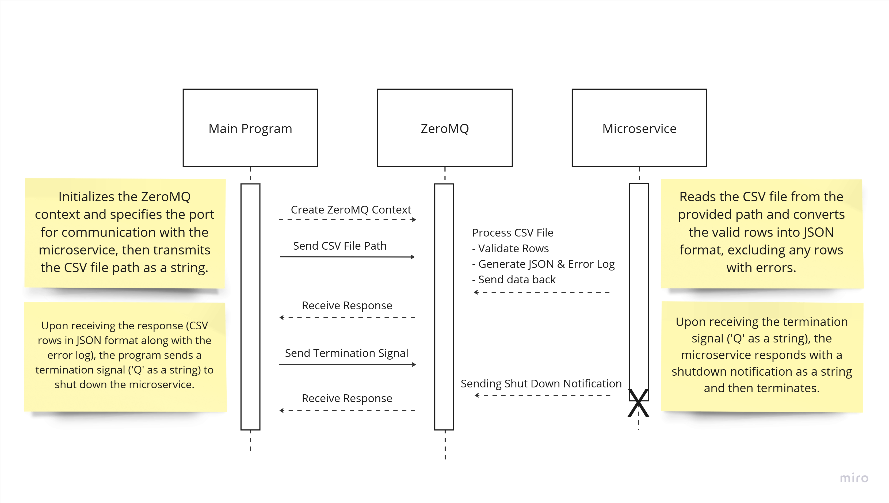

# CSV to JSON Converter

This microservice processes a CSV file containing credit card transactions. Upon receiving the file path from the main program, it performs the following tasks:

1. **File Reading**: Reads the CSV file using the provided path.
2. **CSV to JSON Conversion**: Converts the valid rows of the CSV file into JSON format, excluding rows with errors. This JSON data is sent back to the main program for further processing if required.
3. **Error Logging**: Generates a comprehensive error log, detailing all errors in the CSV file, including their exact location (row and column), to facilitate easy identification and resolution of issues.
4. **Response Handling**: Sends the following back to the main program:
    - Valid rows in JSON format.
    - A detailed error log for review or further processing.

---

## Goals

The microservice is designed to:
- Accept a CSV file path as input.
- Validate the data in the CSV file and identify any erroneous entries.
- Respond to the main program with:
    - JSON representation of valid rows.
    - An error log highlighting issues in the CSV file.

---

## User Stories

### **1. Import and Prepare Data**
As a user, I want to read a CSV file containing financial transactions so that the microservice can process and prepare it for analysis.

**<u>Acceptance Criteria</u>**:
  - **Functional Requirement**: Given a valid path to a CSV file, when the main program initiates a read operation, the microservice should process the file and prepare it for conversion.
  - **Quality Attribute**: Reliability
  - **Non-functional Requirement**: The microservice should handle file imports with a 99% success rate, reliably identifying and processing rows.

### **2. Data Validation and Conversion**
As a user, I want the microservice to validate and convert my CSV data to JSON format so that I have consistent data with errors identified.

**<u>Acceptance Criteria**</u>:
  - **Functional Requirement**: Given the CSV file contains some invalid rows, when the data is read, the microservice should validate each entry, convert valid rows to JSON, and log any errors or skipped rows.
  - **Quality Attribute**: Data Integrity
  - **Non-functional Requirement**: The microservice must maintain data accuracy during validation and conversion, skipping any row with missing or malformed entries.

### **3. Export Converted Data**
As a user, I want the microservice to export my converted data in JSON format so that the main program can use it for further analysis and display.

**<u>Acceptance Criteria</u>**:
  - **Functional Requirement**: Given the JSON conversion is complete, when the JSON data is ready, the microservice should send the data to the main program along with a summary of skipped rows.
  - **Quality Attribute**: Efficiency
  - **Non-functional Requirement**: The microservice should convert and export data in under 3 seconds for files with up to 500 transactions.

---

## Request Parameters

- **`file_path` (string)**: The path to the CSV file containing transaction data. This path will be passed by the main program to the microservice, which will read the file, process it, and return JSON data.

---

## Communication Contract

A. Instructions for **how to programmatically REQUEST data** from the microservice:

To request data, the main program sends the absolute path to the CSV file to the microservice using ZeroMQ. The file path must be a valid string.

<u>Example call to request data:</u> 

```
socket.send_string(r'C:\Path\Transactions.csv)
```

B. Instructions for **how to programmatically RECEIVE data** from the microservice:

To receive data, the main program listens for the microservice's response using ZeroMQ. The response will indicate success or error, along with file paths if successful.

<u>Example call to receive data:</u>

```commandline
socket.recv_json()
```

The response will be shown as:
```
JSON Data:
[{'ID': '1', 'Amount': '1678.49', 'Date': '5/23/2024', 'Description': 'Gas Station', 'Category': 'Transportation'}, ...]

Errors:
Row 3, Incorrect Amount: p
Row 8, Incorrect ID: oo
Row 15, Incorrect Date: invalid_date
...
```

C. **UML Sequence Diagram**


